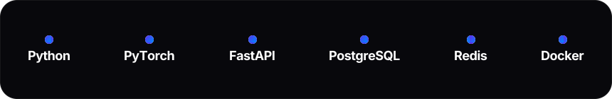

# Diwakar Bhagat

## 🎯 Currently Interested In

* **Motion Representation Learning**: Exploring how machines understand and represent movement.
* **AI-Native ERP Systems**: Reimagining enterprise resource planning with intelligence at the core.
* **Distributed Automation**: Designing pipelines that coordinate complex tasks at scale.
* **Internal Tooling**: Reducing operational overhead through elegant automation.

***

## 💎 Selected Work

## 🛠️ Technical Focus

***

## 🧭 Current Direction

Lately spending more time thinking about:

* **Workflow Orchestration**: How to manage complex dependencies with reliability.
* **Infrastructure Abstractions**: Making the underlying systems invisible to the user.
* **AI-Assisted Operations**: Automating the "boring" parts of system management.
* **System Reliability**: Ensuring stability under real-world usage and high coordination scale.

***

## 🌐 Connect with Diwakar

 
 

