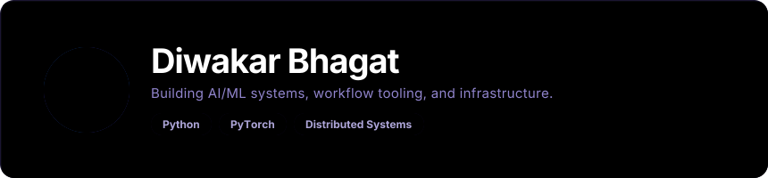
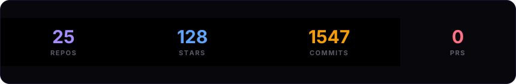
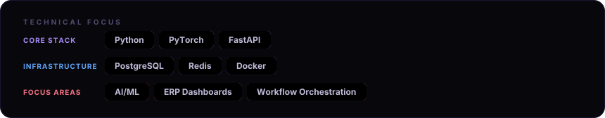

# Diwakar Bhagat

## 🎯 Currently Interested In

* **Motion Representation Learning**: Exploring how machines understand and represent movement.
* **AI-Native ERP Systems**: Reimagining enterprise resource planning with intelligence at the core.
* **Distributed Automation**: Designing pipelines that coordinate complex tasks at scale.
* **Internal Tooling**: Reducing operational overhead through elegant automation.

***

## 💎 Selected Work

***

## 🌐 Connect with Diwakar

 

𝗉𝗈𝗐𝖾𝗋𝖾𝖽 𝖻𝗒 <a href="https://github.com/collectioneur/readme-aura">𝗋𝖾𝖺𝖽𝗆𝖾-𝖺𝗎𝗋𝖺</a>

